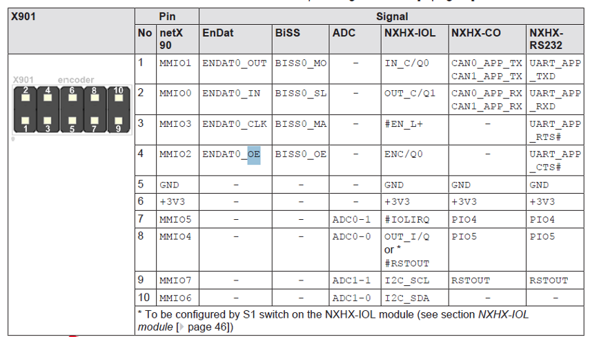
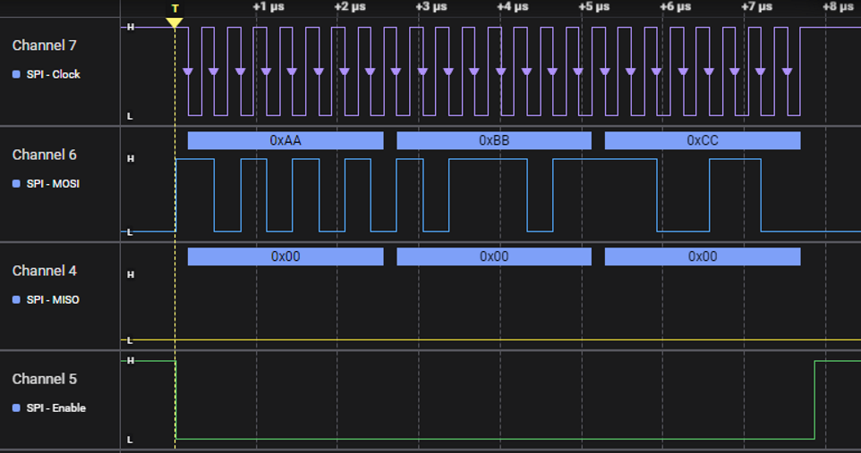

# netX90 DSPIM Module Transmission Test

This project tests the `nx90_dspim` SPI master module on a netX90 platform by initializing the module, transmitting data, and validating proper handling through continuous transmission using a callback function. The test is conducted in loopback mode to confirm the integrity of data transmission and reception.

---

## **Purpose**

The purpose of this project is to test and validate the transmission capabilities of the `nx90_dspim` module. The test involves initializing the SPI master, sending a predefined 14-byte data set, and ensuring the transmission is correctly handled. Continuous transmission is maintained through a callback function to evaluate module performance, with error counters (`asyncErrorCount` and `completeErorCount`) indicating any transmission issues. Keeping these counters at zero demonstrates that the data is being correctly transmitted and received without errors.

---

## **Overview of Main Logic**

The test is implemented in `main.c` with the following steps:

1. **Module Initialization**  
   The SPI master instance (`nx90_dspim_t`) is initialized using the `Nx90Dspim_Init` function. The configuration structure (`nx90_spim_conf`) includes parameters such as:
   - Selected SPI interface (`Netx90SPI1`)
   - Clock frequency (`1.56 MHz`)
   - SPI mode (`Mode 3`, CPOL = 1, CPHA = 1)
   - Loopback mode enabled
   - Hardware-controlled chip enable (`CE0`)

2. **Data Transmission**  
   The test data is transmitted using the `dSpiM_Write()` function. The `CompleteTransferCB()` callback function is registered via `dSpiM_SetTransactionCompleteCallback()` to handle transaction completion events. This callback enables continuous monitoring and transmission, ensuring that errors are promptly detected.

3. **Error Monitoring**  
   The program monitors two key counters:
   - `asyncErrorCount`: Tracks asynchronous transmission errors.
   - `completeErorCount`: Tracks errors related to transaction completion.
   
   Both counters should remain zero throughout the test, indicating that the data is transmitted and received correctly without performance issues.

4. **Infinite Loop**  
   After initiating the transmission, the program enters an infinite loop to continuously monitor events and callbacks.

---

## **Testing Setup**

The test was performed on a **netX90 development board**. The SPI master pins were accessed through the **X901 connector** for ease of connection to the external world. Captures of the connector and the corresponding pin configuration are provided below:

### **Connector Pin Configuration (X901)**

| Pin | Signal      | Description    |
|-----|-------------|----------------|
| 1   | MOSI (MMIO1) | SPI Master Out |
| 2   | MISO (MMIO0) | SPI Master In  |
| 3   | EN0 (MMIO3)  | Chip Enable    |
| 4   | CLK (MMIO2)  | SPI Clock      |

### **Connector Images**

---

## **Key Functions**

- **`Nx90Dspim_Init()`**  
  Initializes the SPI master with the given configuration, enabling features such as loopback mode and interrupt handling.

- **`dSpiM_SetTransactionCompleteCallback()`**  
  Registers a callback function to manage transaction completion. This is essential for continuous data transmission testing and error handling.

- **`dSpiM_Write()`**  
  Sends a predefined data set over SPI.

---

## **Project Files**

- `main.c`: Contains the core test logic for initializing and validating SPI transmission.
- `netx90_dspim.h`: Defines the SPI master interface, configuration structures, and related enumerations.
- `dSpiMaster.h`: Provides base SPI master functionality, including transmission methods and interrupt handling.

---

## **Current Status**

- **Test Date:** February 10, 2025  
- **Tested by:** Todd  
- **Results:** Successful transmission with no errors reported.

---

This is the status if the error variables after 1 minute running:

#### INCLUDE IMAGE OF DEBUG VARIABLES

---

## **Future Enhancements**

- Implement detailed error handling to improve the response to transmission failures.
- Add verification logic to automatically compare transmitted and received data.
- Expand the callback function to handle additional SPI events for broader testing scenarios.
