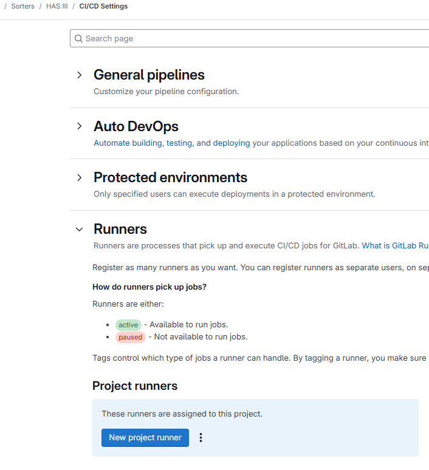
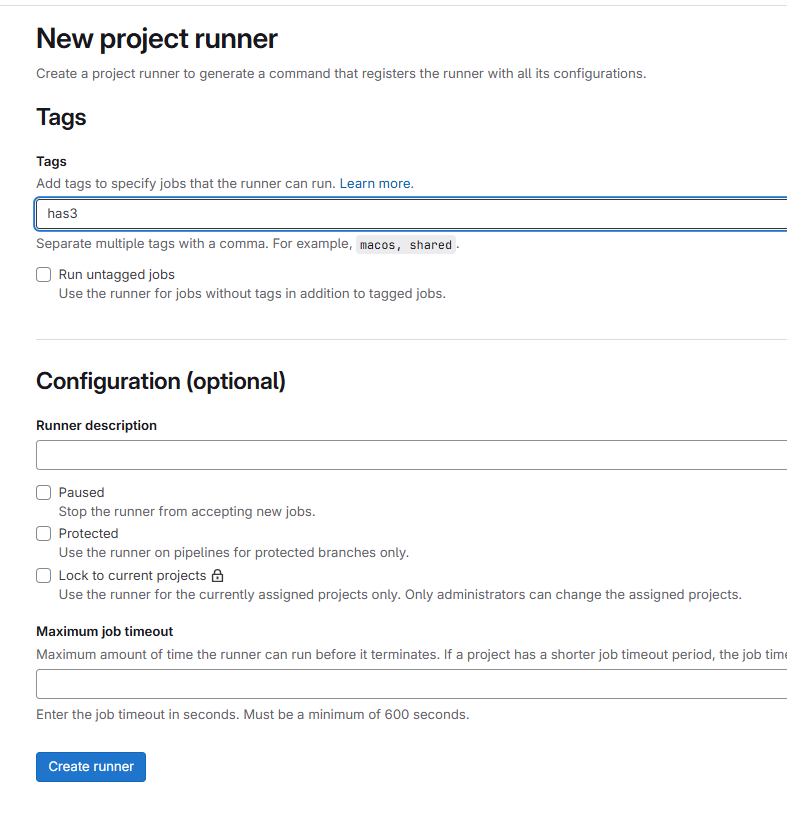
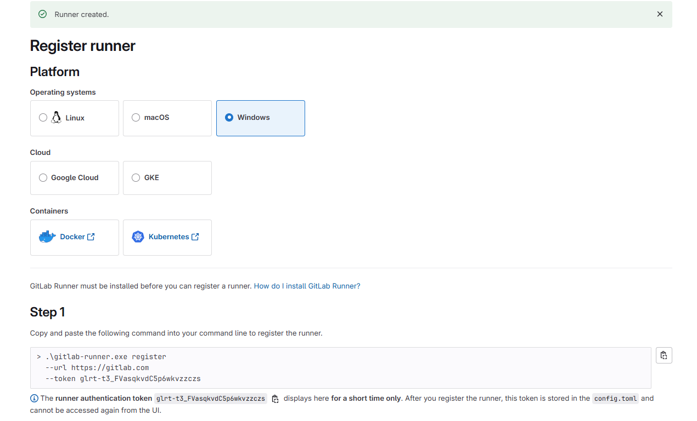
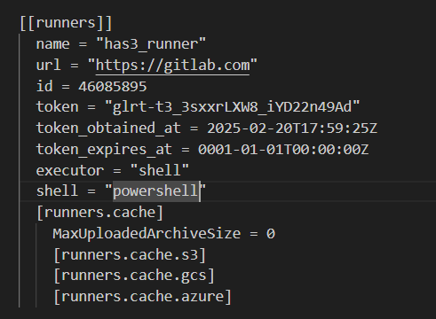
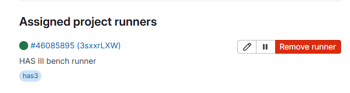

# Windows Runner Setup for HAS III Test Bench

This document explains how to set up the Windows runner for the CI pipelines used in the development of the HAS III project.

## Prerequisites

A computer connected the HAS III Test Bench connected is required. This document focuses solely on the configuration requirements for the Windows runner. The computer must be running Windows with the KION corporate image. Access to the computer should be available using your corporate user credentials.

The required software installations, as specified in the test bench guidelines, specifically:
- Hilscher NetxStudio 
- Visual Studio.

## Configuration
1. Add the waf folder directory to the PATH environment variable (e.g., `C:\netX Studio Portable\BuildTools\waf`).
2. Create an environment variable `GCC_ARM_PATH` that points to the Embedded ARM installation folder of the NetxStudio installation (e.g., `C:\netX Studio Portable\BuildTools\arm-none-eabi-gcc\4.9.3\`).
3. Create an environment variable `PYTHON_WAF` that points to the Python installation folder within the NetxStudio directory (e.g., `C:\netX Studio Portable\BuildTools\python\2.7.11`).

  
## Installation
1. Create a folder on your system, for example, `C:\GitLab-Runner`.
2. Download the [64-bit binary](https://s3.dualstack.us-east-1.amazonaws.com/gitlab-runner-downloads/latest/binaries/gitlab-runner-windows-amd64.exe) and rename it to `gitlab-runner.exe`.
3. Copy the binary to the `C:\GitLab-Runner` folder.
4. Open a command prompt as an administrator in the `C:\GitLab-Runner` folder and keep it open for later steps.
5. Navigate to the HAS III GitLab repository, then go to `Settings -> CI/CD Settings -> Runners` and create a Project runner.

6. Assign the tag `has3` to the runner and create it, leaving all other fields as they are.

7. Select Windows and run the commands provided in `Step 1` on the runner computer.

8. When prompted in the command prompt, select `shell` as the executor.
9. A file named `config.toml` is created in the `C:\GitLab-Runner` folder; open this file and verify that `shell` is set to `"powershell"`.
 

## Running the Test Bench
Since Kion computer users cannot start processes automatically, the runner must be manually started each time the computer boots. This is accomplished by opening a command prompt with elevated privileges in the `C:\GitLab-Runner folder`. Run the following command in the command prompt: 

```powershell
./gitlab-runner.exe run
```
Ensure that the command prompt remains open for as long as the computer is running. 

After a while, the runner should appear as active on the GitLab page under `Settings -> CI/CD Settings -> Runners.`


